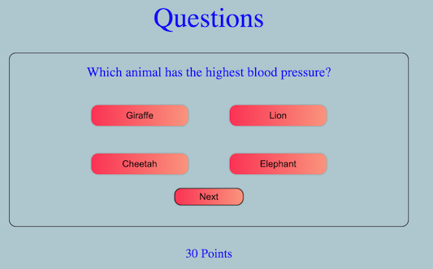

## Introduction
The goal of this tutorial is to understand the deployment of an application on Docker and Kubernetes. We will build a simple multiple-choice quiz application from scratch, and then learn about how to use Docker to containerize the application and Kubernetes to manage these Docker containers. The application will be built using a Python backend, a Postgres database, and a React.js frontend. 



*Above is an image of what the quiz will eventually look like*

## Vocabulary

Before we begin the tutorial, let's briefly describe some of the fundamental vocabulary that will be necessary to know throughout the tutorial. Note that these topics will be described in more detail as you complete the corresponding step in the tutorial.  

- *Full Stack Application*: an application that utilizes a frontend (which the user interacts with to navigate the website), a database (where all the pertinent information for the website is stored), and a backend (allows interaction between the frontend and the database)
- *Docker*: a tool that makes it easy to package and run applications in isolated environments called containers, enabling developers to deploy software quickly and reliably across different systems
- *Kubernetes (K8s)*: a platform that helps manage and orchestrate containers,  allowing a developer to deploy, scale, and manage applications efficiently and reliably in a distributed system
- *Microservices*: architectural approach where applications are built as a collection of small, independent services that communicate with each other. In our case, these services will broadly be the frontend, backend, and database. 
- *Flask*: a lightweight and versatile Python web framework that simplifies the development of web applications, offering a flexible and minimalistic approach for building server-side applications
- *API*: a set of rules and protocols that allows different software applications to communicate and interact with each other, facilitating data exchange
- *Ports*: communication endpoints that enable different applications or services to send and receive data over a network. They can be thought of as doors into an application. The door must be open for visitors in order to send/receive information to/from the device. 

## Useful Links

Below is a list of resources you may find helpful if you need more information about anything as you go through this tutorial. 

- [Building a React App](https://www.freecodecamp.org/news/how-to-build-a-react-project-with-create-react-app-in-10-steps/)
- [Brief Overview of Docker](https://www.youtube.com/watch?v=gAkwW2tuIqE&ab_channel=Fireship)
- [Slightly Longer Overview of Docker](https://www.youtube.com/watch?v=eGz9DS-aIeY&ab_channel=NetworkChuck)
- [Brief Overview of Kubernetes](https://www.youtube.com/watch?v=PziYflu8cB8&ab_channel=Fireship)
- [Slightly Longer Overview of Kubernetes](https://www.youtube.com/watch?v=7bA0gTroJjw&ab_channel=NetworkChuck)
- [Brief Overview of Ngnix](https://www.youtube.com/watch?v=JKxlsvZXG7c&ab_channel=Fireship)
- [Introduction to Helm charts](https://www.youtube.com/watch?v=jUYNS90nq8U&ab_channel=DevOpsJourney)

<!-- *Below is temporarily added to make it easy to delete the folders while testing*

```bash 
cd ~
rm -rf backend
rm -rf database
rm -rf frontend
rm -rf myQuizApp
kubectl delete deployments --all 
kubectl delete svc frontend backend db 
rm backend-deployment.yaml
rm backend-service.yaml
rm db-deployment.yaml
rm db-service.yaml
rm frontend-service.yaml
rm frontend-deployment.yaml
rm k8s_single_file.yaml
rm docker-compose.yaml
``` -->