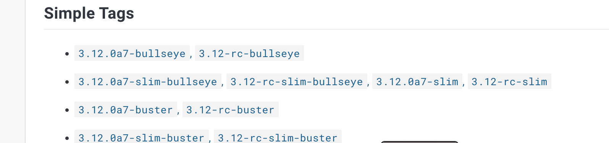

## Step 4: Creating the Dockerfiles

Docker is a widely used software which has three main components. We will go into more detail about these components as we encounter them, but here is a brief intro:

- *Dockerfile*: a blueprint for building a Docker image
- *Docker image*: a template for running Docker containers. These images are shareable on platforms like DockerHub
- *Docker containers*: your actual running application

In this step, we will use Docker to *containerize* each of our three distinct portions of our application (frontend, backend, db) into three separate containers. There are several advantages of these containers including: 

- *Isolation of the environment*: you can test a specific part of your application without worrying that it will impact another part of your application
- *Scalability*: you can easily create multiple containers that will serve your application in the case that your app is widely used
- *Ease-of-development*: you can run these containers on any computer without needing to worry about a particular configuration or dependencies since the Dockerfiles will take care of that for you.  

A Docker container is its own environment. It has nothing preconfigured onto it. We start off with a blank slate and we add to it anything we need for it to run properly, just as we would do on our home computer. Our goal is to write a Dockerfile which will serve as a blueprint for Docker to create the proper environment so that our code can run as expected.  For example: before using *flask* on our computer, we would need to install it by running *pip3 install flask*. Similarly, we will have to do this installation within our Dockerfile. <br><br>

### Part 1: Create the database Dockerfile

Let's create the Dockerfile for our database. In the *database* folder that we created in step 1, let's create another file called *Dockerfile*. Inside of this file, we will write the code that will ultimately serve as our blueprint for the database Docker image. 

You will notice that a Dockerfile contains many commands. Here is a brief overview of some of the most common commands. 

- *FROM*: Docker will build from an existing environment that contains the base application you need (i.e. you can start off with the base files necessary to run Postgres)
- *COPY*: you will copy over your files that you created in your project (i.e. copying over your create_tables.sql files)
- *CMD*: this is what actually will start the script. Here you will place the command necessary to begin the script as you normally would on your own computer, such as *python3 pythonn-api.py* The convention is to place this is a comma-separated list like *CMD ["python3", "python-api.py"]* 

```bash
cd ~/database
cat > Dockerfile <<EOF
# Start off with the official Postgres image
FROM postgres:13-alpine

# PosgreSQL expects you to have defined a POSTGRES_USER and a POSTGRES_PASSWORD. We are setting these up here. We are also defining the name of our database by setting POSTGRES_DB to mydb 
#Set the environment variables for PostgreSQL
ENV POSTGRES_USER=myuser
ENV POSTGRES_PASSWORD=mypassword
ENV POSTGRES_DB=mydb

# Expose the default PostgreSQL port
EXPOSE 5432

#Copy over the pertinent file for creating the database
COPY create_tables.sql docker-entrypoint-initdb.d/create_tables.sql

# Start the PostgreSQL service
CMD ["postgres"]
EOF
```

### Part 2: Create the backend Dockerfile

Let's create the Dockerfile for our backend. In the *backend* folder that we created in step 1, let's create another file called *Dockerfile*. Inside of this file, we will write the code that will ultimately serve as our blueprint for the backend Dockerfile. 

Let's take a second to look at the FROM command below. Note that we are using the *slim-bullseye* version of Python. Ideally, a Docker container should ultimately be lightweight. Thus, if it's suitable for your application, it's good practice to start off your command by using the lightweight (slim) version of the Docker image on DockerHub. You can see all possible versions of the Docker image by searching it on DockerHub. For instance, the below image is the results for "Python" in DockerHub. 

  <br><br>

```bash
cd ~/backend
cat > Dockerfile <<EOF
#Start with a lightweight Python image
FROM python:3.12.0a7-slim-bullseye

#create a directory called app, in which all of the files will go
WORKDIR /app

#This RUN command is necessary to install the packages for psycog2 (in the requirements file)
RUN apt-get update \
    && apt-get -y install libpq-dev gcc

#copy over the requirements.txt file 
COPY requirements.txt requirements.txt

#install everything listed in the requirements.txt file
RUN pip3 install -r requirements.txt

#copy over the rest of the files in your current directory into the working directory of your container (which we set as /app above)
COPY . .

#expose the default Python Flask port
EXPOSE 5000 

#run the python-api.py file
CMD ["python3", "python-api.py", "--host=0.0.0.0"]
EOF
```
Note that this Dockerfile references a file called *requirements.txt*. This file is where we put all of the dependencies that need to be installed before we can actually use Python as intended (i.e Flask, etc). 

Let's create that file. Inside of our *backend* folder, let's create a file called *requirements.txt*. Inside of this file, let's put the required dependencies, which are Flask (used to build server-side applications) and psycopg2 (used to connect to the postgreSQL database):

```bash
cd ~/backend
cat > requirements.txt <<EOF
flask==2.0.1
psycopg2
EOF
```
Now our backend Dockerfile can reference the correct file and we can move on to the final Dockerfile.  

### Part 3: Create the frontend Dockerfile

This part will be a bit more complex. We are going to utilize a nginx reverse-proxy to serve up our frontend container. A reverse proxy acts as an intermediary between the user and the backend servers, forwarding requests to the appropirate endpoint. In order to use nginx, we must first create an *nginx.conf* file. This file dictates the port that nginx will listen on, as well as sets up a proxy_pass that will forward requests from "api/questions" to our backend listening on port 5000. 

```bash 
cd ~/frontend
cat > nginx.conf <<EOF
server {
    # configuring nginx to listen on port 80. This will be relevant later when we get to our docker-compose file.
    listen 80;

    #server_name can be any name that you want when you only have one
    server_name any-name-here;

    #forwards requests at /api/questions to the proxy pass as defined below, with the appropriate headers
    location /api/questions {
        #note: it's port 5000 because our Python file is configured to listen on port 5000. It's called 'backend' here, which will be relevant as the service name in the docker-compose.yaml file we create later.
        proxy_pass http://backend:5000;
        proxy_set_header Host \$host;
        proxy_set_header X-Real-IP \$remote_addr;
        proxy_set_header X-Forwarded-Proto \$scheme;
    }

    #serves the index.html file that is run when you first load the website 
    location / {
        root /usr/share/nginx/html;
        index index.html index.htm;
        try_files \$uri \$uri/ /index.html;
    }
}
EOF
```

Once this file is created, we can create our actual Dockerfile that makes use of the *nginx.conf* file we just created. Note that the Dockerfile makes use of the *build* folder that we commented on in the previous section. 

```bash
cd ~/frontend
cat > Dockerfile <<EOF
# Use an official nginx image as the base image
FROM nginx:latest

# Set the working directory in the container
WORKDIR /frontend_app

#copy the nginx.conf file we just made to a specific container location that's specified as the default container that nginx listens for (you can find this location information in nginx documentation)
COPY nginx.conf /etc/nginx/conf.d/default.conf

#copy the build folder that was made using npm run build. Again, we are placing it in the location specified by documentation.
COPY build /usr/share/nginx/html

# Expose the port where the application will run
EXPOSE 80

# Start the application
CMD ["nginx", "-g", "daemon off;"]
EOF
```


