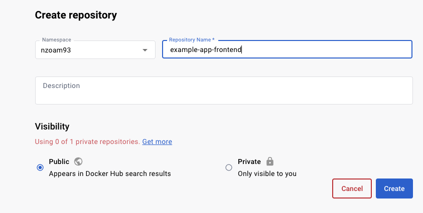

## Step 5: Building the Docker images

In the previous step, we created the Dockerfiles for the database, backend, and frontend. These Dockerfiles serve as the blueprints for what are known as Docker images. These images are ultimately what will be shared amongst developers. They contain everything needed to run your application, including its code and dependencies.  They can be pushed and pulled from registrars like DockerHub just as you might push and pull files from Github.  

### Part 1: Setting up an account on DockerHub
Create an account on hub.docker.com if you don't already have one. Once you created an account, you will be able to push your Docker images to your DockerHub repository, where they can be accessed as needed for your use in docker-compose and kubernetes.

Once logged in to Dockerhub, create three different repositories called "example-app-db", "example-app-backend", and "example-app-frontend." Make sure to make these repos public. Later in this step, you will be pushing your Docker images to these repos.



*Above is an image showcasing what it will look like to create your repo*

After creating these repos, please run the following script. It will prompt you for your Dockerhub username and store it as an environmental variable so that it can be used in future prompts in this section.

```bash
cd $HOME/lab
chmod +x username_prompt.sh
#source makes it so that the env variable is available for use outside of just the username_prompt.sh script itself
source ./username_prompt.sh
```

**Please note that this variable will not be stored if you open a new terminal or if you refresh. Simply run the above command again if you need to re-store your username. You can use the command below in order to test if your variable is correctly stored. Please make sure that this environmental variable is stored before you do any command that involves DOCKERHUB_USERNAME! If not, it will not work correctly since it will not know your username.**

```bash
cd ~
echo "Your username is '$DOCKERHUB_USERNAME'."
```

In order to push and pull from DockerHub, we will need to log in to DockerHub on the command line. As an alternative to providing your password, you can create a secure token in DockerHub that will act as your password, which you can simply delete after this tutorial. To make this token: 
- Click on your profile icon in the top right corner and select "Account Settings" from the dropdown menu.
- Select the "Security" tab.
- Scroll down to "Access Tokens" and click "New Access Token".
- Give the access token a description (e.g. "Docker CLI access") and select the Read & Write permissions. 
- Click "Create" and copy the generated token.

 Now run the following command to log in. For username, simply type your username and then press enter. For the password, copy your newly generated token and press enter. Note that the password will not be shown on the terminal for security reasons.

 Upon success, you should see "login succeeded."
 
 ```bash
 docker login
 ```

### Part 2: Installing Docker Buildx

We will be utilizing a docker plugin called *docker buildx*, which provides additional functionality to our docker build command and allows us to do things like build images for multiple different processors. For instance, we want to make our application accessible on *amd* processors (i.e. Linux OS) and *arm* processors (i.e. new Macbooks with the M1 processors). We can install *buildx* by running the following command:

```bash
mkdir -p ~/.docker/cli-plugins
curl -SL https://github.com/docker/buildx/releases/download/v0.5.1/buildx-v0.5.1.linux-amd64 -o ~/.docker/cli-plugins/docker-buildx
chmod a+x ~/.docker/cli-plugins/docker-buildx
```

Next, we will actually enable the use of *buildx* by running the following command.

```bash
docker buildx create --use
```

Finally, we will intall an eumlator to actually enable the multi-architectural support on a Docker host. 

```bash
docker run --privileged --rm tonistiigi/binfmt --install all
```

### Part 3: Creating the db docker image

We will now use each of the Dockerfiles we created in the previous step in order to create Docker images. The command we run will push our Docker images to the DockerHub repositories that were set up in part 1 of this step. *Note that each of these builds may take a few minutes to finish running.* You will know that you are successful when the command line prompt is again usable. You will also be able to see that the image has been uploaded in your DockerHub repo.

We will start by navigating to the database directory and building the database Dockerfile. The command below will create an image that is compatable for both *amd* processors and *arm* processors, and will push it to your newly made Docker repo. Note that the $DOCKERHUB_USERNAME variable is the username you entered just a moment ago. 

```bash
cd ~/database
docker buildx build --platform linux/amd64,linux/arm64 -t $DOCKERHUB_USERNAME/example-app-db:latest --push .
```

### Part 4: Creating the backend docker image

We will now repeat the previous step for our backend Docker image. We will navigate to the *backend* folder and build the backend Docker image. 

```bash
cd ~/backend
docker buildx build --platform linux/amd64,linux/arm64 -t $DOCKERHUB_USERNAME/example-app-backend:latest --push .
```

### Part 5: Creating the frontend docker image

Lastly, we will repeat the previous step for our frontend Docker image. We will navigate to the *backend* folder and build the backend Docker image. 

```bash
cd ~/frontend
docker buildx build --platform linux/amd64,linux/arm64 -t $DOCKERHUB_USERNAME/example-app-frontend:latest --push .
```


