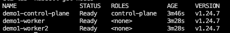
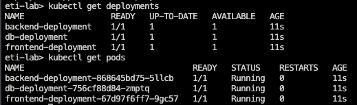
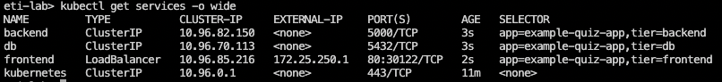

## Step 7: Creating the Kubernetes Files

In step 5, we created Docker images which we made use of in the previous step by creating a *docker-compose.yaml* file. In this step, we are going to go a step further and use Kubernetes (K8s) as a tool to deploy our application.

Why use K8s? When we first introduced Docker, we talked about how one of its advantages is to make our application scalable. This is achieved by simply creating duplicates of each of our containers. However, with this scalability comes an issue. If we have to make a change to our application, we would have to manually update each one of these containers, which would not be feasible. Kubernetes solves this issue by giving us tools to orchestrate our containers in a much simpler fashion, and be able to deploy and update them in a much simpler manner.

A quick intro to K8s: Kubernetes holds the containers inside of a K8s object known as a *pod*. These pods are controlled by *deployments* which will dictate the number of pods needed for our application and ensure that there are always a sufficient number of pods running. We will have three different deployments, one each for our database, our backend, and our frontend. These deployments will be made available to the end user through the use of *services*. We will go through each of these in more detail throughout this step.

### Part 1: Creating the K8s clusters

In this lab, we will make use of the ETILabs environment to create our K8s cluster. A cluster is a group of interconnected nodes - physical or virtual machines - that we can spin up with a simple command in ETILab. These nodes run containerized applications (i.e. the Docker images we created earlier in this tutorial).

```bash
cd ~
$HOME/lab/cluster/cluster_setup.sh
```

This command sets up a 3-node cluster in around 3 minutes.

Now that we have a K8s cluster, we can start to explore around in the environment through the use of the *kubectl* command. For instance, to take a look at the avaiable nodes, run the following command.

```bash
kubectl get nodes
```

This should output something like the following:



If you would like to explore anything in more detail, you can make use of the *describe* command. For instance, to see more information about the *demo1-worker2 node*, we can run:

```bash
kubectl describe node demo1-worker2
```

### Part 2: Creating the K8s database deployment

Now that we have a bit of familiarity with our K8s cluster environment, let's start to create our first deployment. This deployment will create a pod, and the pod will hold the Docker container that will be built from the Docker image we created earlier.

Each K8s object (pod, deployment, service, etc) follows the same basic template below:

```
#specifies which version of the API should be used
apiVersion:

#specifies the object type (i.e. Pod vs Deployment vs Service)
kind:

#specifies info about the object itself (i.e. the object's name)
metadata:

# specifies what the service will be doing (i.e. how many pods should a deployment make)
spec:
```

We will now make our *db-deployment.yaml* file following the above template. Just in case you need it, here is the prompt again to store your username as a variable in ETILabs so that they can be used in the following files.

```bash
cd $HOME/lab
chmod +x username_prompt.sh
#source makes it so that the env variable is available for use outside of just the username_prompt.sh script itself
source ./username_prompt.sh
```

Note that the deployment section has three main segments under *spec*: replicas, template, and selector

- The *replicas* segment tells K8s how many of these containers to make. If you want to make 100 containers, you would put 100 here under spec. In our case, we will simply create a single container so we have *replicas: 1*.

- The *template* segment is where you put the information about the pod. You specify information about the pod under *metadata* and then fill in information about the container such as which image to use under *containers*.

- The purpose of a deployment is to create a specified number of specific pods (i.e. db pods or frontend pods) and to ensure that this number of pods is always maintained. The *selector* segment describes which pods this deployment needs to look after. Note that the labels here match the labels of the *template* section above.

```bash
cd ~
dockerhub_username="$DOCKERHUB_USERNAME" #used to store dockerhub_username env variable
cat > db-deployment.yaml <<EOF
apiVersion: apps/v1
kind: Deployment
metadata:
  #the name of the deployment
  name: db-deployment
spec:
  #how many db pods we want to create
  replicas: 1
  #the template section is where we specify information about the pods
  template:
    metadata:
      name: db-pod
      labels:
        tier: db
    spec:
      containers:
      - name: db-container
        # utilize the db image we created earlier
        image: $dockerhub_username/example-app-db
        #the environmental variables required by Postgres go in this environment section
        env:
        - name: POSTGRES_USER
          value: "myuser"
        - name: POSTGRES_PASSWORD
          value: "mypassword"
        - name: POSTGRES_DB
          value: "mydb"
        ports:
        - containerPort: 5432 #because Postgres is listening on port 5432
  selector:
    #needs to match the label from template > metadata > label above
    matchLabels:
      tier: db
EOF
```

### Part 3: Creating the K8s backend deployment

Next, we will create the *backend-deployment.yaml* file in much the same way.

```bash
cd ~
dockerhub_username="$DOCKERHUB_USERNAME" #used to store dockerhub_username env variable
cat > backend-deployment.yaml <<EOF
apiVersion: apps/v1
kind: Deployment
metadata:
  #the name of the deployment
  name: backend-deployment
spec:
  #how many backend pods we want to create
  replicas: 1
  template:
    metadata:
      name: backend-pod
      labels:
        tier: backend
    spec:
      containers:
      - name: backend-container
        image: $dockerhub_username/example-app-backend #the image we created earlier
        ports:
        - containerPort: 5000 #because backend is listening on port 5000
  selector:
    #needs to match the label from template > metadata > label above
    matchLabels:
      tier: backend
EOF
```

### Part 4: Creating the K8s frontend deployment

Next, we will create the *frontend-deployment.yaml* file in much the same way.

```bash
cd ~
dockerhub_username="$DOCKERHUB_USERNAME" #used to store dockerhub_username env variable
cat > frontend-deployment.yaml <<EOF
apiVersion: apps/v1
kind: Deployment
metadata:
  name: frontend-deployment
spec:
  replicas: 1
  template:
    metadata:
      name: frontend-pod
      labels:
        tier: frontend
    spec:
      containers:
        - name: frontend-container
          image: $dockerhub_username/example-app-frontend
          ports:
          - containerPort: 80 #because nginx frontend listening on port 80
  selector:
    matchLabels:
      tier: frontend
EOF
```

### Part 5: Creating the K8s db service

Okay, so now we have created the files for the deployments, which will make pods. The next step is to make all of our respective pods accessible from an IP address external to the pod itself. For the database and backend, we will accomplish this through the use of a *ClusterIP service*. The frontend will make use of a *LoadBalancer* service in order to make its IP address accessible externally (i.e. from any web browser!)

Let's start with creating the *db-service.yaml* file. We will create a ClusterIP service, which provides *internal* access to the pods to other services in your K8s cluster.

Remember that we can have many identical pods (the exact number of which is determined by the *replicas* section of the deployment), which each have their own IP address. The ClusterIP service provides a stable IP address and port with which to access your desired pods from your other services.

```bash
cat > db-service.yaml <<EOF
apiVersion: v1
kind: Service
metadata:
  name: db #the name is called 'db' here in order to match the name specified as the 'host' earlier when we first made our python-api.py file in step 2. These names NEED to match in order for the service to work properly.
spec:
  type: ClusterIP
  ports: # incoming traffic on this port will be forwarded to the same port on the pods
  - port: 5432
    targetPort: 5432
  selector: #the key-value pairs here match the labels from the db-deployment.yaml file
    tier: db
EOF
```

### Part 6: Creating the K8s backend service

Next, let's create the *backend-service.yaml* file. We will create a ClusterIP service which will make our backend pods accessible to the other services (db and frontend).

```bash
cat > backend-service.yaml <<EOF
apiVersion: v1
kind: Service
metadata:
  name: backend #note: our frontend application expects this to be exactly "backend" as we defined in the nginx.conf file.
spec:
  type: ClusterIP
  ports:
  - port: 5000
    targetPort: 5000
  selector: #the key-value pairs here match the labels from the backend-deployment.yaml file
    tier: backend
EOF
```

### Part 7: Creating the K8s frontend service

Next, let's create the *frontend-service.yaml* file. We will create a LoadBalancer service which will give us an external IP to make our frontend accessible to the outside world so that we can access it on the internet.

```bash
cat > frontend-service.yaml <<EOF
apiVersion: v1
kind: Service
metadata:
  name: frontend
spec:
  #gives an external IP that is accessible on the internet
  type: LoadBalancer
  ports:
  - port: 80
    targetPort: 80
  selector: #the key-value pairs here match the labels from the frontend-deployment.yaml file
    tier: frontend
EOF
```

### Part 8: Creating a namespace specific for this app

It's generally a good idea to have a separate namespace for each different application you are making. In this case, let's create a namespace for our quizapp called quiz-app-ns. We will then switch to this namespace and create all of our K8s files within it, which will help for organization.

```bash
kubectl create namespace quiz-app-ns
kubectl config set-context --current --namespace=quiz-app-ns
```

### Part 9: Using the service files we just created

Okay, we have now created a namespace, as well as files for deployments and our services. Our deployments will each create pods, and our services make those pods accessible to each other and to the outside world.

Now let's actually use our files to create our deployments and services. We will make use of the *create -f filename* command in order to do this. Note that the order in which you do the commands is important. If something depends on another (i.e. our frontend deployment depends on our backend service), then it should come after it in the command. 


```bash
cd ~
kubectl create -f db-deployment.yaml
kubectl create -f db-service.yaml
kubectl create -f backend-deployment.yaml
kubectl create -f backend-service.yaml
kubectl create -f frontend-deployment.yaml
kubectl create -f frontend-service.yaml
```

To check to see if you have done everything correctly, you can run the following kubectl command. You should see three deployments for the db, backend, and frontend, as well as three corresponding pods!

```bash
kubectl get deployments
kubectl get pods
```

This should output something like the following. Note that if you see *0/1* under the *ready* column, simply wait a moment and then run the previous command again until all pods are shown to be ready.



We can view the services that we just created as well as the external IP address of the frontend container by running the following command. If we did it correctly, we should see our two ClusterIPs that we created for the db and backend, as well as our LoadBalancer that we created for our frontend.

```bash
kubectl get services -o wide
```

This should output something like the following:



### Part 10: Using Caddy

In the preceding parts, we created our deployment and service files. We are so close to being able to see our application! If we were using a service like GKE (Google Kubernetes Engine), then this would indeed have been the final step and we could simply visit the external IP address of our frontend LoadBalancer service. However, on the ETILab environment, we have one small step to go: we need to make our ETILab environment externally accessible and we will accomplish this by utilizing a web server called Caddy. It will connect our frontend IP address at port 80 (which is where our frontend container is listening) to our current web URL (eticloud.io) at port 8080.

First, please run the following command and enter the external IP address of your frontend LoadBalancer service. This should be visible in your terminal from the previous step. In my example above, it was *172.25.250.1*

```bash
cd $HOME/lab
chmod +x external_ip_prompt.sh
source ./external_ip_prompt.sh
```

Now let's run the Caddy command to actually connect the URLs.

```bash
caddy reverse-proxy --from :8080 --to $EXTERNAL_ADDRESS:80 > /dev/null 2>&1 &
```

### Part 11: Viewing our deployment

If you didn't do so earlier, let's make sure that our docker-compose file from earlier is no longer still running by running the following command. This will ensure that the site we are about to see is indeed being deployed through Kubernetes and no longer through Docker.

```bash
cd ~
docker-compose down
```

 Now we can actually go see the result of our work! Click [this link](http://location.hostname:8080) and view your application.

**Congratulations, you have successfully deployed your application on Kubernetes!**
