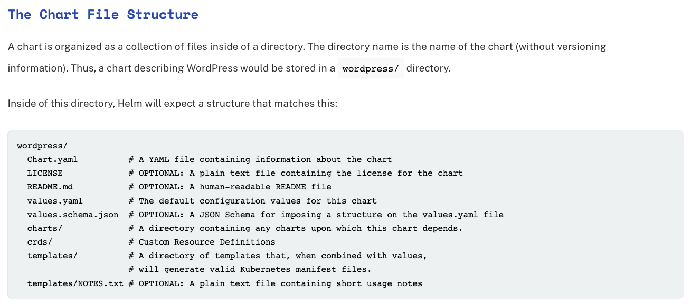

## Step 13: Creating a Helm Chart

In our previous K8s example, we created three distinct deployment files and three distinct service files for a relatively simple quiz application. This process can be simplified through the use of Helm, which is commonly referred to as the Kubernetes Service Manager. Helm can be used to deploy K8s applications more seamlesslly, and with a single command rather than having several *kubectl create* commands.

Helm is already configured on ETILabs so we can get to an example right away.

### Part 1: Creating Folder Structure and Files

The below image is an example of the file structure for a helm chart and is from the official Helm website. Note that many of these files are optional so we will begin our example without those particular files.



***To create our own file structure, let's create a folder called *myQuizApp*. Inside of this folder, let's create the non-optional files: *Chart.yaml*, which ...., *values.yaml*, in which we store variables, as well as the directories *charts/*, which... , *crds/*, which... and *templates*, which ....***

```bash
cd ~
mkdir myQuizApp
cd myQuizApp
touch Chart.yaml
touch values.yaml
mkdir charts
mkdir crds
mkdir templates
```

### Part 2: Populating the templates directory and *Chart.yaml* file

The templates directory we just created will contain the Kubernetes manifest (.yaml) files. Let's move the six Kubernetes files we created in step 7 into this new directory. We can simply copy them and place them in the templates folder.

```bash
cd ~
cp db-deployment.yaml db-service.yaml backend-deployment.yaml backend-service.yaml frontend-deployment.yaml frontend-service.yaml ./myQuizApp/templates
```

The *Chart.yaml* file contains basic info about our helm chart, including the apiVersion, name, description, type, version, and appVersion.

```bash
cd ~/myQuizApp
cat > Chart.yaml <<EOF
apiVersion: v2
name: webapp1
description: A Helm chart for Kubernetes

# A chart can be either an 'application' or a 'library' chart.
#
# Application charts are a collection of templates that can be packaged into versioned archives
# to be deployed.
#
# Library charts provide useful utilities or functions for the chart developer. They're included as
# a dependency of application charts to inject those utilities and functions into the rendering
# pipeline. Library charts do not define any templates and therefore cannot be deployed.
type: application

# This is the chart version. This version number should be incremented each time you make changes
# to the chart and its templates, including the app version.
# Versions are expected to follow Semantic Versioning (https://semver.org/)
version: 0.1.0

# This is the version number of the application being deployed. This version number should be
# incremented each time you make changes to the application. Versions are not expected to
# follow Semantic Versioning. They should reflect the version the application is using.
# It is recommended to use it with quotes.
appVersion: "1.16.0"
EOF
```

### Part 3: Testing out helm

Even this early on, we can see one benefit of using helm. We can now use a single command to begin our app, rather than the six "create -f" commands from earlier.

However, before we begin, let's remove the previous deployments, pods, and services so that we can ensure that we are starting fresh with this new single-file deployment.

```bash
cd ~
kubectl delete deployments --all
kubectl delete svc frontend backend db
```

After running the previous command, we can ensure that our app is no longer running by going to the quiz application page and refreshing. We should get an error saying *This page isn't working*.

Now let's actually deploy our application with a single *helm* command.

```bash
cd ~
helm install myquizapp-release myQuizApp
```

You should now be able to refresh the quiz page from earlier and see the quiz working as before! Helm works!

### Part 4: Utilizing the *images.yaml* File

A key benefit of Helm is that you can define variables inside of the *images.yaml* file. Variables are defined in a key-value pair like *appName: myQuizApp*. Then, you can simply refer to them by the variable name inside your file and you can easily change all variable names at once by changing the single key-value pair in the images.yaml file.

Let's get some practice with this. Inside of our *images.yaml* file, let's create the aforementioned key-value pair for appName.

```bash
cd ~/myQuizApp
cat > values.yaml <<EOF
appName: myQuizApp
EOF
```

Now that we have that, let's utilize it in our document. We can do so by placing it in curly-braces like this {{ .Values.appName }}. Let's go ahead and replace each instance of *appName* with {{ .Values.appName }}. If you would like, you can do so manually. Alternatively, just press the following commands, which will replace each of our previous files in the *myQuizApp/templates* directory of our Helm chart with files that contain our variable names.

Updating the db-deployment.yaml file:

```bash
cd ~/myQuizApp/templates
dockerhub_username="$DOCKERHUB_USERNAME" #used to store dockerhub_username env variable
cat > db-deployment.yaml <<EOF
apiVersion: apps/v1
kind: Deployment
metadata:
  #the name of the deployment
  name: db-deployment
  #labels that can be used to sort through our containers as needed
  labels:
    app: {{ .Values.appName }}
    tier: db
spec:
  #how many db pods we want to create
  replicas: 1
  template:
    metadata:
      name: db-pod
      labels:
        app: {{ .Values.appName }}
        tier: db
    spec:
      containers:
      - name: db-container
        image: $dockerhub_username/example-app-db
        #the environmental variables required by Postgres go in this environment section
        env:
        - name: POSTGRES_USER
          value: "myuser"
        - name: POSTGRES_PASSWORD
          value: "mypassword"
        - name: POSTGRES_DB
          value: "mydb"
        ports:
        - containerPort: 5432 #because PG is listening on port 5432
  selector:
    #needs to match the label from template > metadata > label above
    matchLabels:
      app: {{ .Values.appName }}
EOF
```

Updating the db-service.yaml file:

```bash
cd ~/myQuizApp/templates
cat > db-service.yaml <<EOF
apiVersion: v1
kind: Service
metadata:
  name: db #NOTE: many applications expect this name to be exactly "db" and not anything else
  labels:
    name: db-service
    app: {{ .Values.appName }}
spec:
  type: ClusterIP #groups the db pods together into a single IP address that is accessible by the other services
  ports:
  - port: 5432
    targetPort: 5432
  selector: #copy the labels from the db-deployment.yaml file into the selector below
    app: {{ .Values.appName }}
    tier: db
EOF
```

Updating the backend-deployment.yaml file:

```bash
cd ~/myQuizApp/templates
cat > backend-deployment.yaml <<EOF
apiVersion: apps/v1
kind: Deployment
metadata:
  #the name of the deployment
  name: backend-deployment
  #labels that can be used to sort through our containers as needed
  labels:
    app: {{ .Values.appName }}
    tier: backend
spec:
  #how many backend pods we want to create
  replicas: 1
  template:
    metadata:
      name: backend-pod
      labels:
        app: {{ .Values.appName }}
        tier: backend
    spec:
      containers:
      - name: backend-container
        image: $dockerhub_username/example-app-backend #the image we created earlier
        ports:
        - containerPort: 5000 #because backend is listening on port 5000
  selector:
    #needs to match the label from template > metadata > label above
    matchLabels:
      app: {{ .Values.appName }}
EOF
```

Updating the backend-service.yaml file:

```bash
cd ~/myQuizApp/templates
cat > backend-service.yaml <<EOF
apiVersion: v1
kind: Service
metadata:
  name: backend #note: my frontend application expects this to be exactly "backend"
  labels:
    name: backend-service
    app: {{ .Values.appName }}
spec:
  type: ClusterIP #groups the backend pods together
  ports:
  - port: 5000
    targetPort: 5000
  selector: #copy the labels from the backend-deployment.yaml file into the selector below
    app: {{ .Values.appName }}
    tier: backend
EOF
```

Updating the frontend-deployment.yaml file:

```bash
cd ~/myQuizApp/templates
cat > frontend-deployment.yaml <<EOF
apiVersion: apps/v1
kind: Deployment
metadata:
  name: frontend-deployment
  labels:
    app: {{ .Values.appName }}
    tier: frontend
spec:
  replicas: 1
  template:
    metadata:
      name: frontend-pod
      labels:
        app: {{ .Values.appName }}
        tier: frontend
    spec:
      containers:
        - name: frontend-container
          image: $dockerhub_username/example-app-frontend
          ports:
          - containerPort: 80 #because nginx frontend listening on port 8081
  selector:
    matchLabels:
      app: {{ .Values.appName }}
EOF
```

Updating the frontend-service.yaml file:

```bash
cd ~/myQuizApp/templates
cat > frontend-service.yaml <<EOF
apiVersion: v1
kind: Service
metadata:
  name: frontend
  labels:
    name: frontend-service
    app: {{ .Values.appName }}
spec:
  #gives an external IP that is accessible on the internet
  type: LoadBalancer
  ports:
  - port: 80
    targetPort: 80
  selector: #copy the labels from the frontend-deployment.yaml file into the selector below
    app: {{ .Values.appName }}
    tier: frontend
EOF
```

### Part 5: Using the updated files

As always when we are trying to see the results of our new process, let's delete the previous deployments and services.

```bash
cd ~
kubectl delete deployments --all
kubectl delete svc frontend backend db
```

Now that we have updated the files in part 4, we can run a simple command to tell Helm to use these files. This is very similar to the previous helm install command. The two differences are that we are no longer initiating the helm from scratch so we use *upgrade* instead of *install*. Also, now that we have an value file, we have to tell helm to use it by including the *--values* along with the path to the values file from the current directory.

```bash
cd ~
helm upgrade myquizapp-release myQuizApp --values ./myQuizApp/values.yaml
```

Congrats, you have now utilized the *values.yaml* to successfully deploy your application using Helm.

You can change as many variables as you would like following the same process outlined in the previous two steps. Then, simply run the upgrade command again and see the results of your work.
